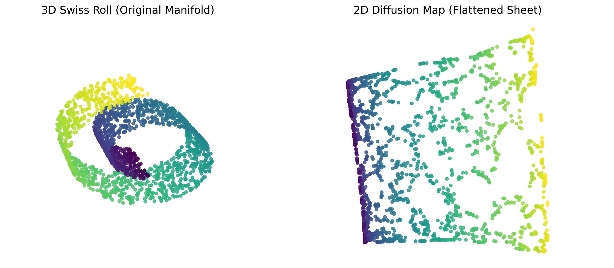

# Diffusion Maps for Non-Linear Dimensionality Reduction



## Overview
This repository contains a highly optimized, modular Python implementation of the **Diffusion Map** manifold learning algorithm. It provides robust tools for non-linear dimensionality reduction, transitioning seamlessly between dense matrix operations and scalable sparse (k-nearest neighbors) graph constructions.

The project demonstrates the mathematical and practical strengths of Diffusion Maps through two main applications:
1. **Toy Dataset Exploration**: Unrolling a dynamically stretched 3D Swiss Roll into a 2D plane to visualize non-linear eigen-coordinate mappings.
2. **Real-World Application (UCI HAR)**: Reducing the high-dimensional 561-feature **Human Activity Recognition (UCI HAR)** dataset into a purely non-linear 80-dimensional eigenspace. The embedded coordinates are then used to train a predictive `RandomForestClassifier` with high accuracy.

## Key Features
- **Extensible API (`diffmap.py`)**: Cleanly computes spectral embeddings bridging native dense implementations and highly optimized sparse graphs utilizing `scipy.sparse`.
- **Automatic Bandwidth Selection (`helpers.py`)**: Dynamically approximates the optimal Gaussian kernel bandwidth ($\epsilon$) utilizing the automated Berry-Giannakis-Harlim (BGH) error heuristic.
- **Leak-Free Nyström Extension (`helpers.py`)**: Computes ultra-fast approximations to project pure out-of-sample points (e.g., Test Sets) onto the pre-learned manifold via sparse cross-kernel probability matrices, thoroughly eliminating data leakage.
- **End-to-End Pipeline (`main.ipynb`)**: Walkthrough notebooks that handle data processing, tabular display with `pandas`, training, Nyström testing, and predictive evaluations.

## Project Structure
```text
Diffusion-Map/
│
├── README.md               # Project documentation
├── requirements.txt        # Python dependencies
│
├── code/
│   ├── diffmap.py          # Core dense/sparse Diffusion Map logic
│   ├── helpers.py          # Eigensolvers, BGH heuristic, and Nyström extension
│   └── main.ipynb          # Interactive Jupyter notebook with visualization & ML testing
│
├── dataset/
│   └── UCI HAR Dataset/    # Human Activity Recognition raw txt sequences
│
└── images/                 # Plotted manifold outputs
```

## Getting Started

### 1. Prerequisites
Ensure you have Python 3.8+ and pip installed. All major data-science packages are required:
* `numpy`
* `scipy`
* `scikit-learn`
* `matplotlib`
* `pandas`
* `jupyter`

### 2. Installation
Clone the repository and install the dependencies:
```bash
git clone https://github.com/BanAnA9205/Diffusion-Map.git
cd Diffusion-Map
pip install -r requirements.txt
```

### 3. Usage
Navigate to the `code/` directory and launch Jupyter Notebook to run the interactive pipeline:
```bash
cd code
jupyter notebook main.ipynb
```

## Application Results
In the provided `main.ipynb`, the algorithm extracts a hyper-compressed representation of the 7,000+ sample UCI HAR spatial tracking dataset. 
- Discovers best variables mapped at exactly $k=15$ neighbors, $\epsilon$ auto-calculated by BGH, and $n\_components=80$. 
- Achieves **~88%+ prediction accuracy** on the fully sequestered out-of-sample Test split using an off-the-shelf Random Forest classifier exclusively trained on the underlying continuous mathematical structure (Diffusion Coordinates).

## License
This project is licensed under the [MIT License](LICENSE).